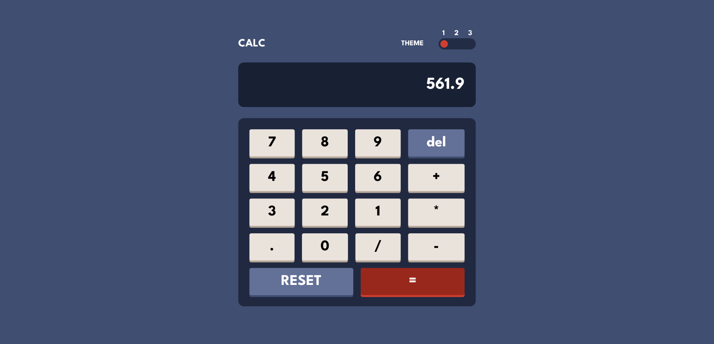

# 🎨 Multi-Theme Calculator App

This is a **React** + **TypeScript** calculator app built as part of a [Frontend Mentor](https://www.frontendmentor.io) challenge. It supports **3 distinct visual themes**, animated transitions using **Framer Motion**, and state management with **Zustand**.

## 🛠 Tech Stack

- ⚛️ **React** — Component-based UI
- ⛑️ **TypeScript** — Type-safe logic
- 💨 **Tailwind CSS** — Utility-first styling
- 🎞 **Framer Motion** — Smooth UI animations
- 🧠 **Zustand** — Global state management

## 🎯 Features

- ✅ Fully functional calculator
- 🎨 **3 Unique themes** with toggle switch
- 🌗 Theme preference persists using `localStorage`
- ⚡ Smooth theme transition animations with Framer Motion
- 📱 Responsive & mobile-friendly
- 🔍 Clean, maintainable code structure

## 🚀 Getting Started

```bash
# Clone the repo
git clone https://github.com/your-username/multi-theme-calculator.git

# Navigate into the project
cd multi-theme-calculator

# Install dependencies
npm install

# Start the development server
npm run dev
```

#

## 📸 Screenshots


